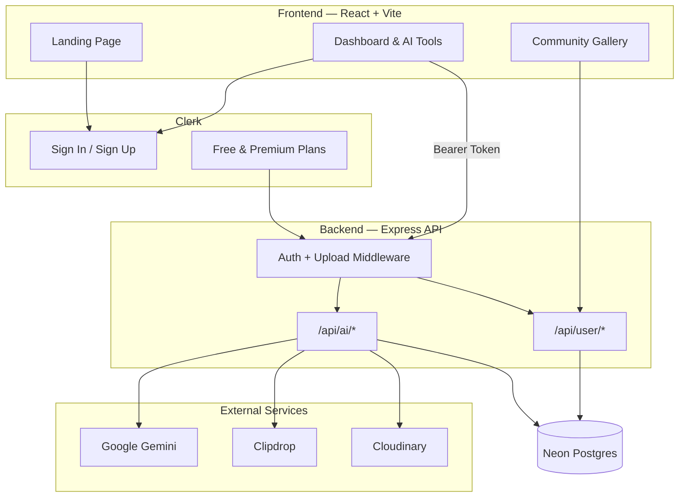

<div align="center">

# Him.Ai

### Your all-in-one AI creation studio — write, design, edit, and review in one place.

[](https://him-quickai-frontend.onrender.com/)
[](https://react.dev/)
[](https://vitejs.dev/)
[](https://expressjs.com/)
[](https://tailwindcss.com/)
[](https://clerk.com/)

**[Launch App](https://him-quickai-frontend.onrender.com/)** · **[API Backend](https://him-quickai-backend.onrender.com/)**

*Built for creators, writers, designers, and job seekers who want AI tools that actually ship.*

</div>

---

## What is Him.Ai?

**Him.Ai** is a full-stack AI SaaS platform that bundles six production-ready tools behind a single, polished dashboard. Generate articles and blog titles, create images, clean up photos, review resumes, and share your best work with the community — all powered by **Google Gemini**, **Clipdrop**, and **Cloudinary**, with **Clerk** handling auth and subscriptions.

The app is split into a **React + Vite** frontend and an **Express** API, backed by **Neon Postgres** for persistent creation history.

---

## Live Deployment

| Service | Platform | URL |
|---------|----------|-----|
| **Frontend** | Render | [https://him-quickai-frontend.onrender.com](https://him-quickai-frontend.onrender.com/) |
| **Backend API** | Render | [https://him-quickai-backend.onrender.com](https://him-quickai-backend.onrender.com/) |
| **Database** | Neon | Serverless Postgres |

---

## Highlights

| | |
|---|---|
| **6 AI tools** | Articles, blog titles, images, background removal, object removal, resume review |
| **Creation history** | Every output saved to your personal dashboard |
| **Community gallery** | Publish images and get likes from other users |
| **Free + Premium** | Clerk billing with usage limits on the free tier |
| **Mobile-ready** | Responsive UI; resume upload optimized for mobile devices |
| **Multi-format resumes** | Accepts PDF, DOC, DOCX, and TXT |

---

## AI Toolkit

<table>
  <tr>
    <th>Tool</th>
    <th>What it does</th>
    <th>Plan</th>
  </tr>
  <tr>
    <td><strong>AI Article Writer</strong></td>
    <td>Long-form articles from a topic + length selector</td>
    <td>Free / Premium</td>
  </tr>
  <tr>
    <td><strong>Blog Title Generator</strong></td>
    <td>5 SEO-friendly title suggestions from a keyword</td>
    <td>Free (10 uses) / Premium</td>
  </tr>
  <tr>
    <td><strong>AI Image Generation</strong></td>
    <td>Text-to-image via Clipdrop, stored on Cloudinary</td>
    <td>Free / Premium</td>
  </tr>
  <tr>
    <td><strong>Background Removal</strong></td>
    <td>Upload a photo, get a clean cutout</td>
    <td>Premium</td>
  </tr>
  <tr>
    <td><strong>Object Removal</strong></td>
    <td>Describe what to remove — AI handles the rest</td>
    <td>Premium</td>
  </tr>
  <tr>
    <td><strong>Resume Reviewer</strong></td>
    <td>Upload a resume (PDF/DOC/DOCX/TXT) for AI feedback</td>
    <td>Free / Premium</td>
  </tr>
</table>

**Also included:** Dashboard with stats & filters · Community feed with likes · Clerk sign-in & pricing

---

## Architecture



---

## Tech Stack

### Frontend (`client/`)

| Layer | Technology |
|-------|------------|
| Framework | React 19, Vite 8 |
| Routing | React Router 7 (HashRouter) |
| Styling | Tailwind CSS 4, Typography plugin |
| Auth & Billing | Clerk (`@clerk/react`) |
| HTTP | Axios |
| UI/UX | Framer Motion, Lucide React, React Hot Toast |
| Content | React Markdown, Remark GFM, Type Animation |

### Backend (`server/`)

| Layer | Technology |
|-------|------------|
| Runtime | Node.js, ES Modules |
| Framework | Express 5 |
| Auth | Clerk Express |
| Database | Neon Serverless Postgres |
| AI | Google Gemini (OpenAI-compatible SDK) |
| Images | Clipdrop API, Cloudinary transformations |
| File Upload | Multer (memory for resumes, disk for images) |
| Documents | pdf-parse, mammoth, word-extractor |

---

## Project Structure

```
QUICKAI/
├── client/                    # React frontend
│   ├── src/
│   │   ├── components/        # Navbar, Hero, Sidebar, AiTools, etc.
│   │   ├── pages/             # Home, Dashboard, 6 AI tool pages, Community
│   │   ├── assets/            # Images, icons, AiToolsData
│   │   └── utils/             # Auth helpers
│   ├── env.example
│   └── package.json
│
├── server/                    # Express API
│   ├── controllers/           # aiController, userController
│   ├── routes/                # aiRoutes, userRoutes
│   ├── middlewares/           # auth, upload (resume)
│   ├── configs/               # db, cloudinary, multer (images)
│   ├── utils/                 # resumeText extraction
│   ├── env.example
│   └── server.js
│
└── README.md
```

---

## App Routes

### Public

| Route | Page |
|-------|------|
| `/#/` | Landing page — hero, tools, testimonials, pricing |
| `/#/ai/community` | Public gallery of published images |

### Authenticated (`/#/ai/*`)

| Route | Page |
|-------|------|
| `/#/ai` | Dashboard — stats, creation history, quick actions |
| `/#/ai/write-article` | AI Article Writer |
| `/#/ai/blog-titles` | Blog Title Generator |
| `/#/ai/generate-images` | AI Image Generation |
| `/#/ai/remove-background` | Background Removal |
| `/#/ai/remove-object` | Object Removal |
| `/#/ai/review-resume` | Resume Reviewer |

---

## API Reference

### AI Endpoints — `POST /api/ai/*`

| Endpoint | Auth | Body | Description |
|----------|------|------|-------------|
| `/generate-article` | Yes | `{ prompt, length }` | Generate article |
| `/generate-blog-title` | Yes | `{ prompt, blogCategories }` | Generate 5 titles |
| `/generate-image` | Yes | `{ prompt, publish }` | Text-to-image |
| `/remove-image-background` | Premium | `FormData` (`image`) | Remove background |
| `/remove-image-object` | Premium | `FormData` (`image`, `object`) | Remove object |
| `/resume-review` | Yes | `FormData` (`resume`) | Review resume |

### User Endpoints — `/api/user/*`

| Endpoint | Method | Auth | Description |
|----------|--------|------|-------------|
| `/get-user-creations` | GET | Yes | User's saved creations |
| `/get-published-creations` | GET | No | Community feed |
| `/toggle-like-creations` | POST | Yes | Like / unlike a creation |

All authenticated requests require:

```
Authorization: Bearer <clerk_session_token>
```

---

## Getting Started

### Prerequisites

- Node.js 18+
- Accounts: [Clerk](https://clerk.com), [Neon](https://neon.tech), [Google AI Studio](https://aistudio.google.com), [Clipdrop](https://clipdrop.co), [Cloudinary](https://cloudinary.com)

### 1. Clone the repository

```bash
git clone https://github.com/your-username/QUICKAI.git
cd QUICKAI
```

### 2. Set up the database

Create a `creations` table in Neon:

```sql
CREATE TABLE creations (
  id SERIAL PRIMARY KEY,
  user_id TEXT NOT NULL,
  prompt TEXT,
  content TEXT,
  type TEXT NOT NULL,
  publish BOOLEAN DEFAULT false,
  likes TEXT[] DEFAULT '{}',
  created_at TIMESTAMPTZ DEFAULT NOW(),
  updated_at TIMESTAMPTZ DEFAULT NOW()
);
```

### 3. Configure the backend

```bash
cd server
cp env.example .env
npm install
npm run server
```

**Server environment variables** (`server/.env`):

| Variable | Description |
|----------|-------------|
| `PORT` | Server port (default `3000`) |
| `DATABASE_URL` | Neon Postgres connection string |
| `CLERK_SECRET_KEY` | Clerk secret key |
| `GEMINI_API_KEY` | Google AI Studio API key |
| `GEMINI_MODEL` | Gemini model (e.g. `gemini-2.0-flash`) |
| `CLIPDROP_API_KEY` | Clipdrop text-to-image key |
| `CLOUDINARY_CLOUD_NAME` | Cloudinary cloud name |
| `CLOUDINARY_API_KEY` | Cloudinary API key |
| `CLOUDINARY_API_SECRET` | Cloudinary API secret |

### 4. Configure the frontend

```bash
cd client
cp env.example .env
npm install
npm run dev
```

**Client environment variables** (`client/.env`):

| Variable | Description |
|----------|-------------|
| `VITE_CLERK_PUBLISHABLE_KEY` | Clerk publishable key |
| `VITE_BASE_URL` | Backend URL (`http://localhost:3000` locally) |

### 5. Open the app

```
Frontend → http://localhost:5173
Backend  → http://localhost:3000
```

---

## Deployment

### Frontend (Render)

1. Connect the repo to Render
2. **Root directory:** `client`
3. **Build command:** `npm install && npm run build`
4. **Start command:** `npx serve -s dist` (or use a static site preset)
5. Set `VITE_CLERK_PUBLISHABLE_KEY` and `VITE_BASE_URL=https://him-quickai-backend.onrender.com` as build-time env vars

**Live:** [https://him-quickai-frontend.onrender.com](https://him-quickai-frontend.onrender.com/)

### Backend (Render)

1. **Root directory:** `server`
2. **Build command:** `npm install`
3. **Start command:** `npm start`
4. Add all server env vars from `server/env.example`

**Live:** [https://him-quickai-backend.onrender.com](https://him-quickai-backend.onrender.com/)

---

## Plans & Limits

| Feature | Free | Premium |
|---------|------|---------|
| Article Writer | Limited | Unlimited |
| Blog Titles | 10 generations | Unlimited |
| Image Generation | Yes | Yes |
| Background Removal | — | Yes |
| Object Removal | — | Yes |
| Resume Review | Yes | Yes |
| Community Publishing | Yes | Yes |

Billing is managed through **Clerk Pricing Table** on the landing page.

---

## Screenshots

> Replace placeholders with real screenshots from your deployed app.

| Landing Page | AI Dashboard | Resume Review |
|:---:|:---:|:---:|
| Hero + tools grid | Stats + creation history | Upload + AI feedback |
| Community | Image Generation | Mobile View |
| Public gallery + likes | Style picker + publish | Fully responsive |

---

## Scripts

### Client

```bash
npm run dev       # Start Vite dev server
npm run build     # Production build
npm run preview   # Preview production build
npm run lint      # ESLint
```

### Server

```bash
npm run server    # Dev with nodemon
npm start         # Production (node server.js)
```

---

## Why Him.Ai?

Most AI apps do one thing. **Him.Ai** brings writing, imaging, editing, and career tools together under one roof — with auth, billing, history, and a community layer already wired up. It is a real SaaS starter you can extend, not a single-feature demo.

---

<div align="center">

**Built with React, Express, Gemini, and a lot of coffee.**

If this project helped you, consider giving it a star.

</div>
